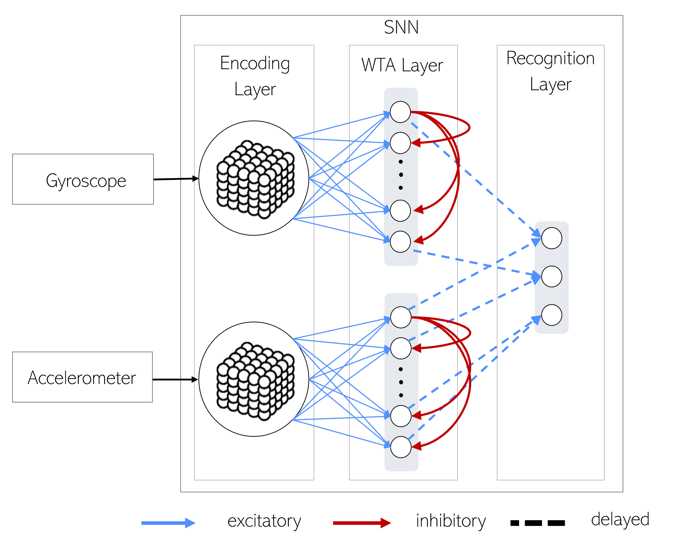
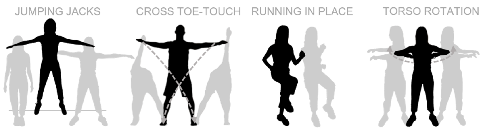

# Neuromorphic System for the Identification of Maneuvers in Three-Dimensional Space

This repository contains the code used in the thesis 'Neuromorphic System for the Identification of Maneuvers in Three-Dimensional Space'.
The work implements the following Spiking Neural Network using Brian2 that can recognize spatiotemporal patterns corresponding to workout movements.

-BLE - contains a Python script to acquire data from an accelerometer and gyroscope, built-in a SensorTag, using Bluetooth Low Energy

-CCS - contains the Code Composer Studio project that should be uploaded to the SensorTag. This project is modified version of TI's ProjectZero. It implements a custom BLE service. There are two workspace available:
- workspace_v88         : saves multiple sensor readings and sends in burst (increases the sensors sampling frequency by sendind 251 bytes of data at 100 Hz)
- workspace_v88_100hz   : sends a single sensors readings (from accelerometer and gyroscope) at 100 Hz (BLE transmission frequency can be increased but the approach of the ws above works better)

-Dataset - has workout movement samples characterized by accelerometer and gyroscope data. Each folder corresponds to a movement. In each folder there are multiple .txt files. Each file corresponds to a movement being performed repeatedly for some time. Ultimately, each file will originate multiple samples for a specific movement. The next image depicts the performed movements.

## Running the code
To reproduce the experience described in the thesis using the acquired data:

1. Run the 'learning.ipynb' notebook. You can choose different values for the input firing rate but also need to adjust the WTA neurons threshold. The next table shows some possible tested values.

| Input rate (Hz) | WTA threshold (mV) |
|:---------------:|:------------------:|
|50               |-60                 |
|60               |-59                 |
|70               |-59                 |
|80               |-58                 |
|90               |-58                 |
|100              |-57                 |

Change the corresponding variables in both notebooks (learning and testing) in cell 4

After running the notebook, a folder called 'training_output' will be created. This folder will contain recordings of the weights during the learning stage. 

2. The notebook 'testing.ipynb' will assess the network performace, for any set of weights recorded during learning. To choose the sets of weights you want to use (e.g. test against all recordings or just the last one), head to cell 32 of the notebook. 
